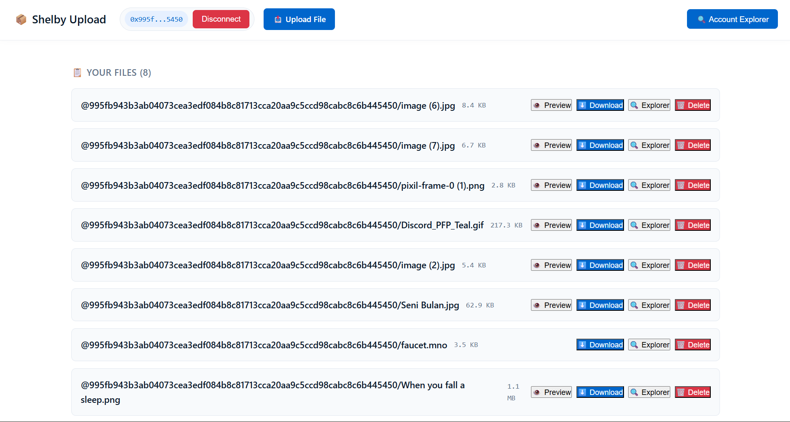

# 📦 Shelby Upload - Decentralized File Storage

A web application for uploading and downloading files to **Shelby Protocol** using **Aptos blockchain** as the coordination layer.

## 🚀 Implemented Features

| Feature | Status | Description |
|---------|--------|-------------|
| **Connect Wallet (Petra)** | ✅ Working | Can connect & disconnect wallet |
| **Upload File** | ⚠️ Partial | Files appear in explorer but shows 401 error |
| **Download File** | ✅ Working | All files can be downloaded |
| **List Files** | ✅ Working | Displays files in gallery |
| **Image Preview** | ⚠️ Broken | Preview not working |
| **Delete File** | ❌ Error | Cannot delete files |
| **Account Explorer** | ✅ Working | Link to Shelby Explorer |

## 🎯 Application Screenshot



## 🔧 Technologies Used
- **Frontend**: React 18 + TypeScript + Vite
- **Blockchain**: Aptos Testnet
- **Storage**: Shelby Protocol
- **Wallet**: Petra Wallet
- **State Management**: TanStack Query
- **Styling**: Custom CSS

## 📦 Package Versions

```json
{
  "@aptos-labs/ts-sdk": "5.2.1",
  "@aptos-labs/wallet-adapter-react": "7.2.8",
  "@shelby-protocol/react": "1.0.3",
  "@shelby-protocol/sdk": "0.2.3",
  "@tanstack/react-query": "5.90.21",
  "react": "18.3.1",
  "react-dom": "18.3.1"
}
🐛 Known Issues
1. Delete File Not Working
Error: The specified blob was not found

Cause: Delete API might not be implemented on the server for testnet

Status: ❌ Cannot delete files

2. Image Preview Error
Error: Preview doesn't show when clicked

Cause: MIME type application/octet-stream prevents browser from rendering directly

Workaround: Use Download button to view files

3. Upload File Shows 401 Error But Files Are Uploaded
Error: Failed to start multipart upload! status: 401

Observation: Files actually appear in explorer despite the error

Possible Cause: SDK error in response handling, but upload succeeds

Status: ⚠️ Files are uploaded despite error message

4. File Names Display Format
Files are displayed with the account address prefix in the gallery

This is part of Shelby's default storage format

📊 File Statistics
File Name	Size	Preview Available
image(6).jpg	8.4 KB	✅
image(7).jpg	6.7 KB	✅
pixil-frame-0(1).png	2.8 KB	✅
Discord_PFP_Teal.gif	217.3 KB	✅
image(2).jpg	5.4 KB	✅
faucet.mno	3.5 KB	❌
Whenyoufalla	1.1 MB	✅
Total Files: 7 uploaded files

File Types: Images (jpg, png, gif), text file

File Sizes: 2.8KB - 1.1MB

🚀 How to Run
bash
# Clone repository
git clone <repo-url>

# Install dependencies
npm install

# Setup environment variables
cp .env.example .env
# Fill .env with your API keys:

VITE_APTOS_API_KEY=your_aptos_api_key_here
VITE_SHELBY_API_KEY=your_shelby_api_key_here
VITE_SHELBY_NETWORK=testnet
VITE_SHELBY_RPC=https://api.testnet.shelby.xyz/shelby
VITE_SHELBY_EXPLORER=https://explorer.shelby.xyz

# Run the application
npm run dev
🎉 Conclusion
The application successfully:

✅ Connects to Petra wallet

✅ Displays uploaded files in gallery

✅ Downloads files correctly

✅ Links to Shelby Explorer

Known issues with upload error handling, delete functionality, and image preview need to be addressed in future updates.

📸 Gallery Preview
https://./gallery.png

📝 Notes for Error 401 During Upload
typescript
// TODO: Investigate 401 error despite successful upload
// Possible cause: SDK treats 401 response as error even though file is processed
// Workaround: Check explorer to verify files are actually uploaded
📄 License
MIT

Built with ❤️ using Shelby Protocol + Aptos
